# Petstore in IBM API Connect
This article explains how to use the swagger/Open API specifications for the  Petstore API provided by swagger.io both with OAS V2 and V3 in IBM API Connect.
This is a point in time statement. The behaviour of IBM API Connect may change in the future and simplifies the use of those APIs.

I have used for this test IBM API Connect 10.0.1.5

The use of the petstore sample provided by Swagger.io has been used quite a lot in the past. 
It needs to be updated in order to work without any issues in API Connect. The security configuration for OAuth requires a configuration that does not exsit by default for example.

The two Swaggers based respectively on 1.0.6 (OAS2) and 1.0.9 (OAS3) can be found below.

| Version      | Documentation                 | Link to specification document                   | Corrected                                                           |
|--------------|-------------------------------|--------------------------------------------------|---------------------------------------------------------------------|
| 1.0.6 (OAS2) | https://petstore.swagger.io/  | https://petstore.swagger.io/v2/swagger.json      | [apic oas2](./materials/swagger-petstore_1.0.6.ok.yaml)             |
| 1.0.9 (OAS3) | https://petstore3.swagger.io/ | https://petstore3.swagger.io/api/v3/openapi.json | [apic oas3](./materials/swagger-petstore-openapi-3-0_1.0.9.ok.yaml) |

**Hint**: To get the two "corrected" API specification files:
```
curl -LO https://raw.githubusercontent.com/ADesprets/petstore/master/materials/swagger-petstore_1.0.6.ok.yaml
curl -LO https://raw.githubusercontent.com/ADesprets/petstore/master/materials/swagger-petstore-openapi-3-0_1.0.9.ok.yaml
```

**Hint**: To get the two original API specification files:
```
curl -LO https://petstore.swagger.io/v2/swagger.json
curl -LO https://petstore3.swagger.io/api/v3/openapi.json
```

In the following chapter some explanations on how to use the API and the explanations of what was done to make it work.

## OAS 2
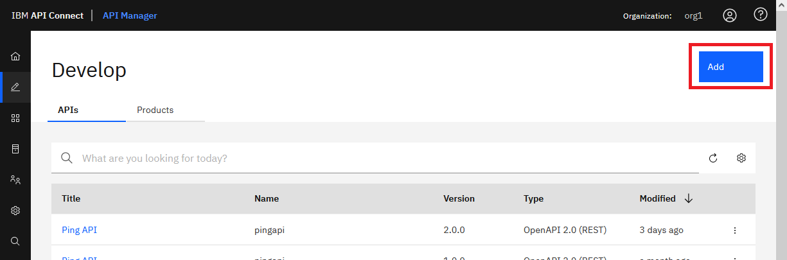

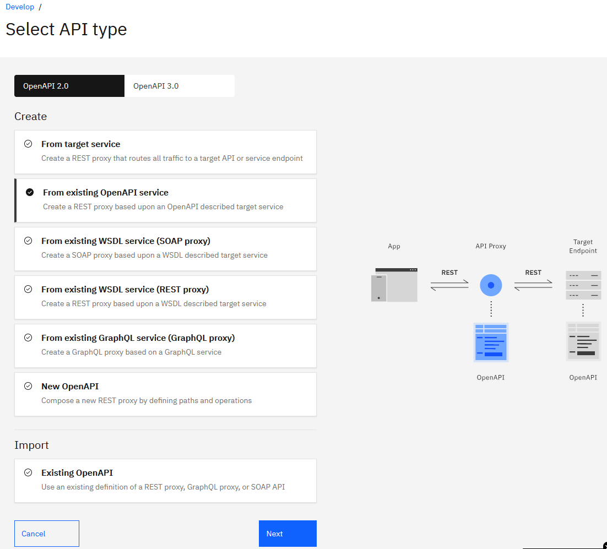

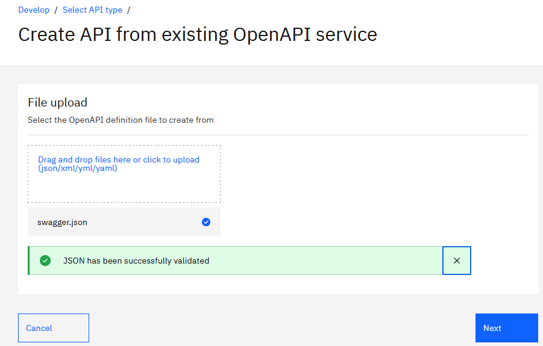

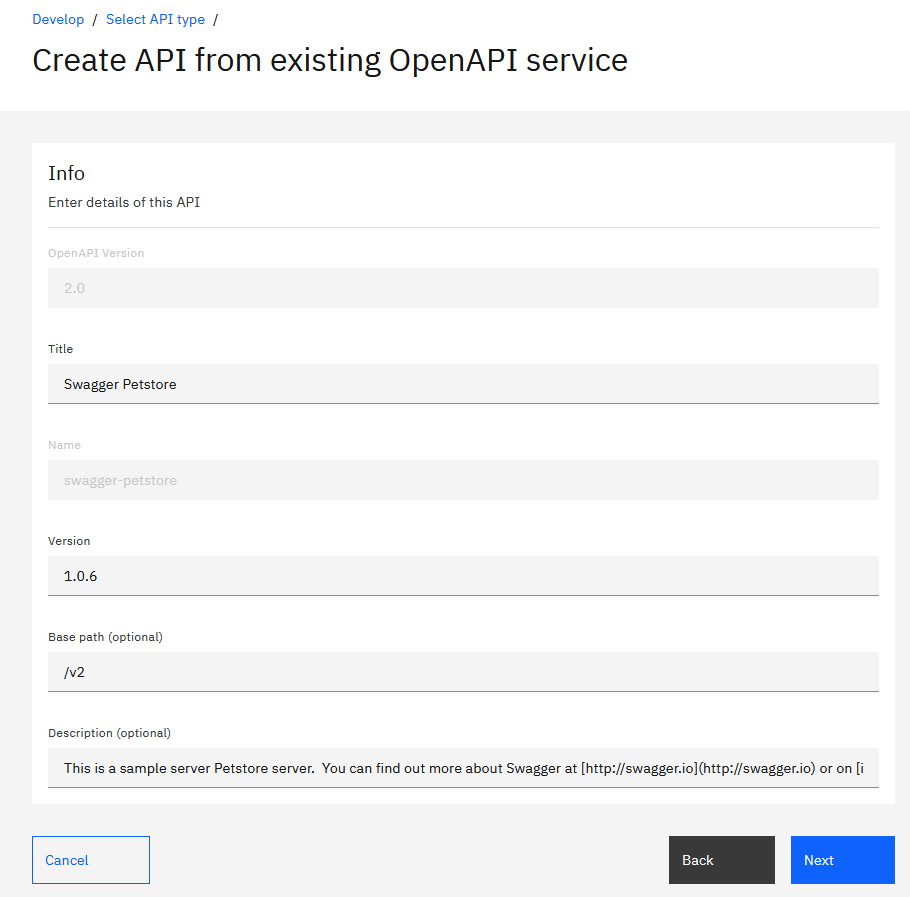


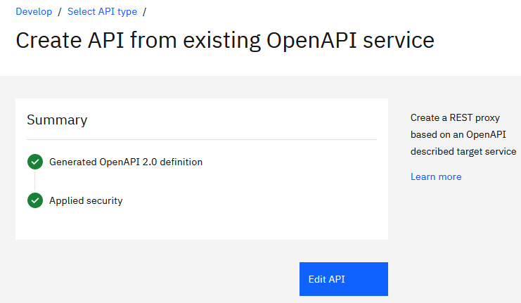

The API contains errors.

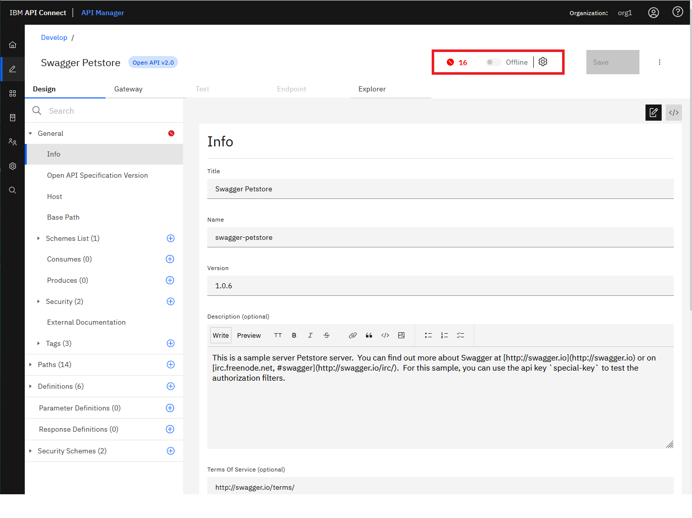

**Hint**: To track the changes I'm going to download the orginal API on the disk (to get it in yaml format).
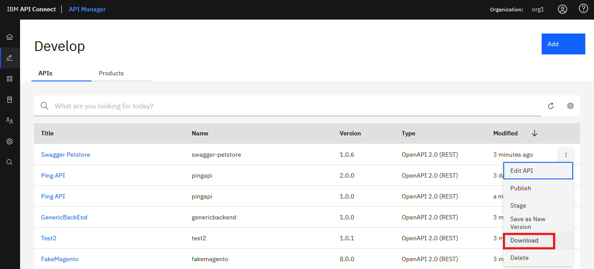

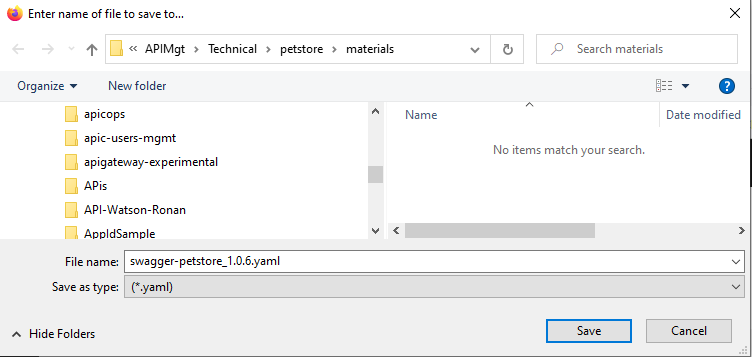

After slightly adapting the API everythings is working for more information see at the end the chapter explanations.
To facilitate the operation, I provide in this article the corrected API specifications (See original table at the top). So you can simply upload the corrected version and start ot use it.
Below activating the "corrected" API.
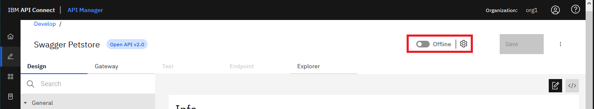
Then testing it
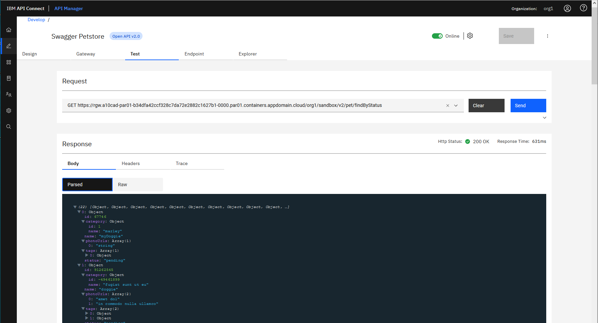

## OAS 3
When using the Open API V3, the import of the API is slightly different as explained here.

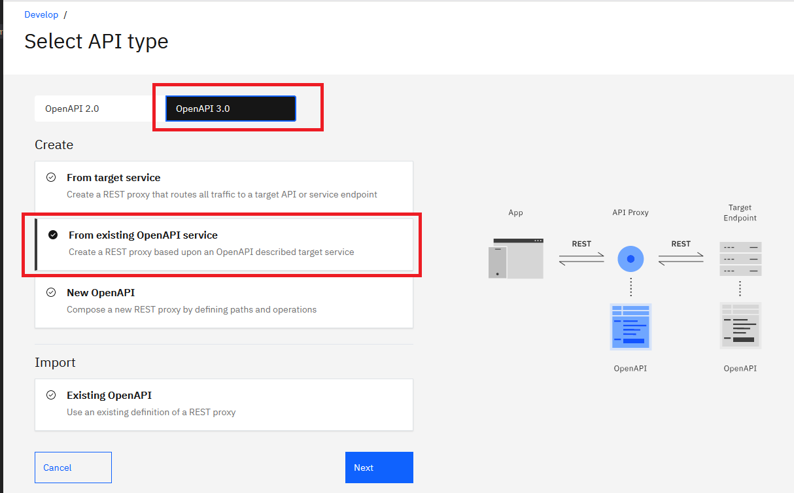
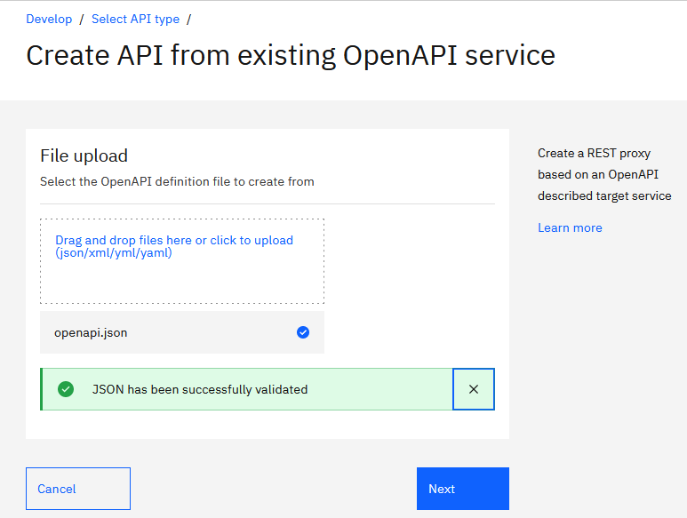
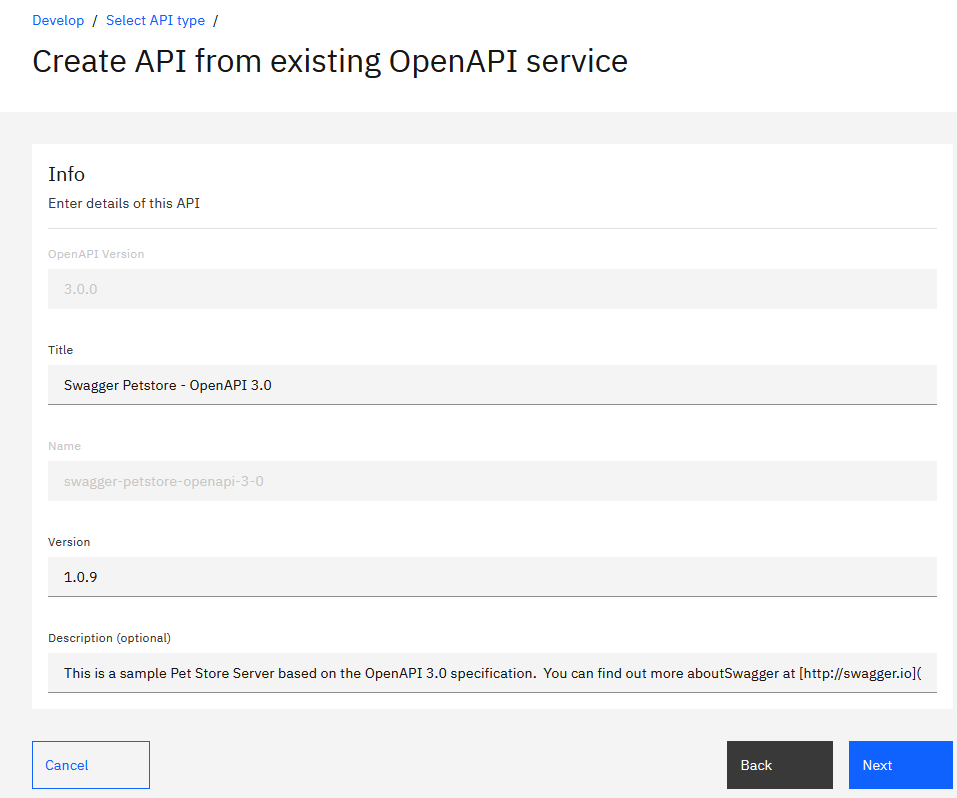

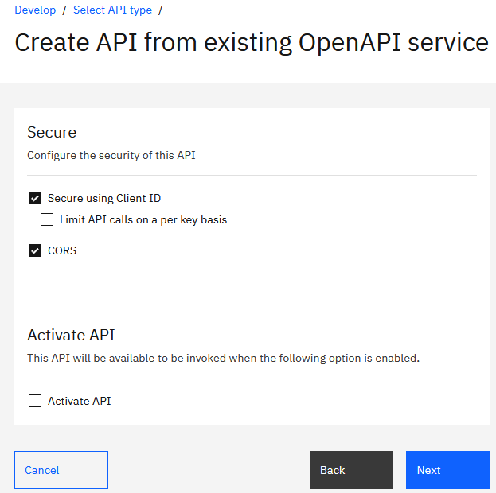

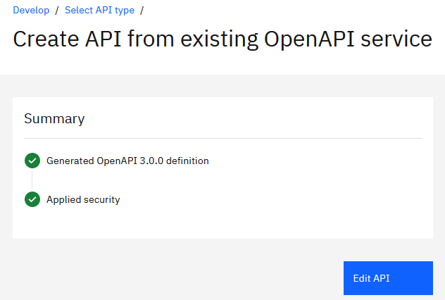

The API contains errors.

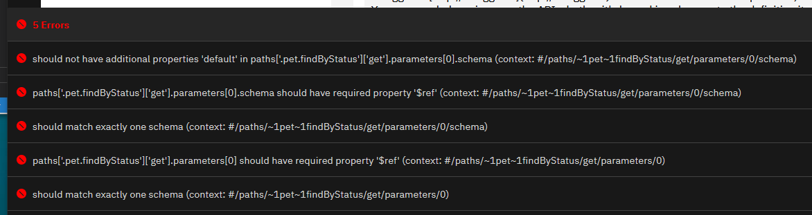

# Explanations
This chapter explains in more details the changes operated. You can also use the diff on the various yaml files located in materials directory.

## OAS 2
step 1 - Remove upload image path
step 2 - Fix api key
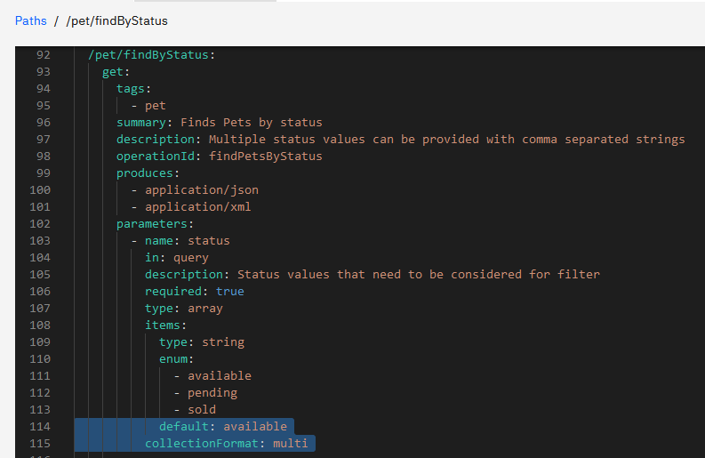
step 3 - Remove unsupported parameters definitions
            default: available
          collectionFormat: multi

step 4 - Remove OAuth security to simply, in another version of this document we will explain how to fix this one. You can check this link to learn more about OAth with an external provider [OAuth with external provider](https://github.com/ADesprets/bluemix-labs/blob/master/Lab%20API%20-%20Manage%20your%20APIs%20with%20API%20Connect/README-V10.md#protecting-an-api-with-oauth---external-provider) "OAuth with external provider")

## OAS 3
step 1 - Remove unsupported parameters definitions
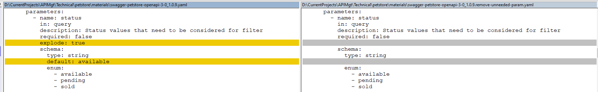
step 2 - Remove security definitions (schemes and security)
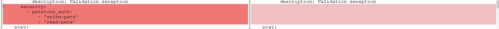
step 3 - Fix the endpoint within the properties
step 4 - Fix the endpoint within the properties
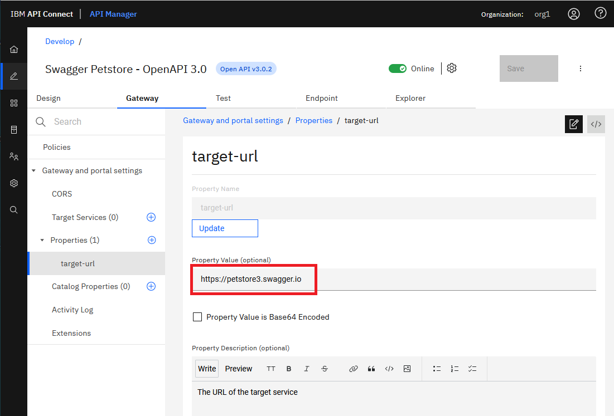
